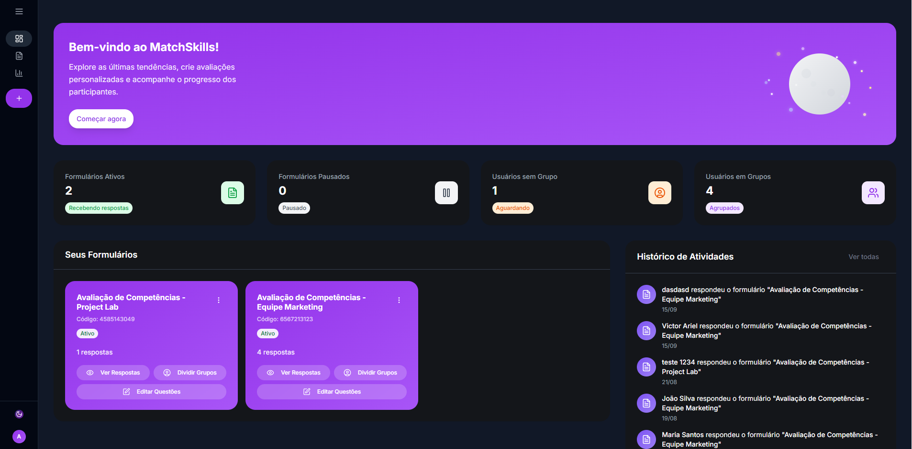
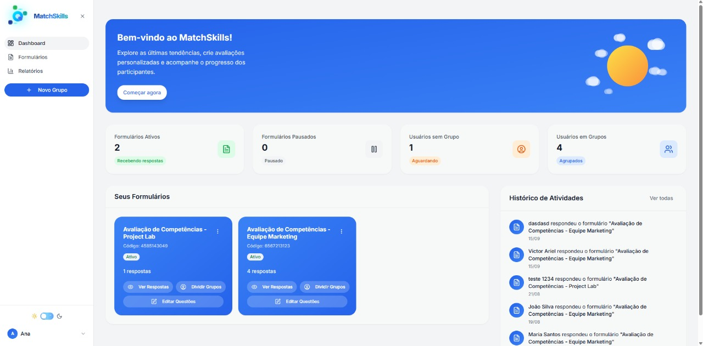
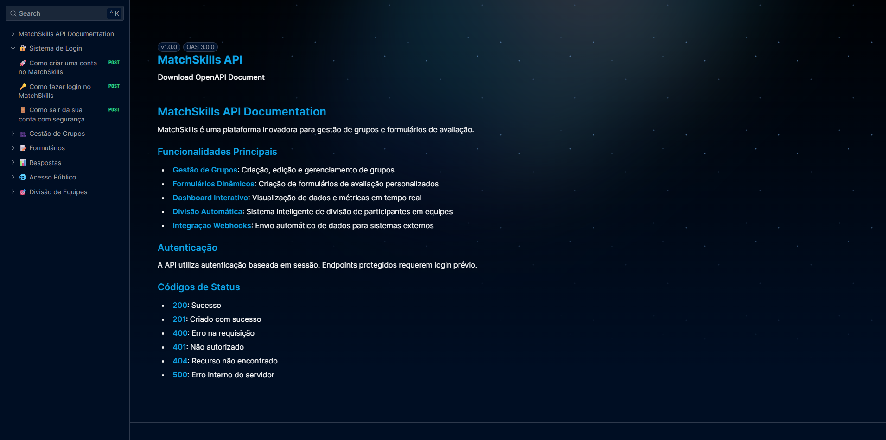

<div align="center">

# 🎯 Matchskills

### Dashboard - Modo Escuro

*Interface elegante com animação de céu noturno e métricas em tempo real*

### Dashboard - Modo Claro  

*Design clean com animação de céu diurno e visualização clara dos dados*

### Documentação da API

*Documentação interativa da API com Swagger/Scalar - teste endpoints em tempo real*

---

## 🚀 Funcionalidades PrincipaisTransforme a forma como você cria e gerencia formulários de avaliação

**Uma plataforma moderna e intuitiva para criação de formulários, gestão de grupos e análise de competências**

[](https://github.com/victorarielima/MatchSkills)
[](LICENSE)
[](https://azure.microsoft.com)
[](https://www.typescriptlang.org/)
[](https://reactjs.org/)

</div>

---

## 🌟 Sobre o Projeto

O **MatchSkills** é uma solução completa para gestão de grupos e formulários de avaliação personalizados. Desenvolvido com as tecnologias mais modernas, oferece uma experiência fluida tanto para organizadores quanto para participantes.

### ✨ Por que usar o MatchSkills?

- 🎨 **Interface Moderna**: Design limpo e intuitivo com suporte a Dark Mode
- ⚡ **Alta Performance**: Construído com React e TypeScript para máxima velocidade
- 📊 **Análises Detalhadas**: Visualize dados com gráficos e nuvem de palavras
- 🔄 **Integração N8N**: Automação de processos com webhooks
- 📱 **100% Responsivo**: Funciona perfeitamente em qualquer dispositivo
- 🌙 **Dark Mode Inteligente**: Detecção automática de preferência do sistema

---

## 📸 Demonstração

### Dashboard - Modo Escuro

*Interface elegante com animação de céu noturno e métricas em tempo real*

### Dashboard - Modo Claro  

*Design clean com animação de céu diurno e visualização clara dos dados*

---

## � Funcionalidades Principais

## 🚀 Funcionalidades Principais

### 📋 Gestão Completa
- ✅ **Gestão de Grupos**: Criação, edição e gerenciamento de grupos com limites personalizáveis
- ✅ **Formulários Dinâmicos**: Criação de formulários de avaliação com múltiplos tipos de perguntas
- ✅ **Templates Prontos**: Modelos pré-configurados (DISC, MBTI, Big Five e mais)
- ✅ **Dashboard Interativo**: Visualização de dados e métricas em tempo real com animações

### 🎨 Experiência do Usuário
- ✅ **Dark Mode Automático**: Detecção e troca suave entre temas
- ✅ **Animações Suaves**: Efeitos visuais de céu (sol, lua, estrelas, nuvens)
- ✅ **Design Responsivo**: Interface otimizada para desktop, tablet e mobile
- ✅ **Feedback Visual**: Glows e transições no modo escuro

### 📊 Análises e Relatórios
- ✅ **Relatórios Detalhados**: Análise completa de respostas por formulário
- ✅ **Nuvem de Palavras**: Visualização inteligente de respostas de texto livre
- ✅ **Gráficos Interativos**: Distribuição de respostas com barras e percentuais
- ✅ **Exportação de Dados**: Download de relatórios em múltiplos formatos

### 🔗 Integrações
- ✅ **Integração N8N**: Webhook para automação de processos
- ✅ **Divisão Automática**: Sistema inteligente de divisão de equipes
- ✅ **Envio de Dados**: Webhook automático com dados de divisão de grupos

### 🔒 Segurança
- ✅ **Autenticação Segura**: Sistema de login via Supabase
- ✅ **Validação de Dados**: Sanitização no frontend e backend
- ✅ **Banco de Dados**: PostgreSQL para persistência confiável

---

## 🛠️ Tecnologias Utilizadas

### Frontend
- **React 18** - Biblioteca UI moderna
- **TypeScript** - Tipagem estática
- **Vite** - Build tool ultra-rápido
- **TailwindCSS** - Estilização utility-first
- **Shadcn/ui** - Componentes acessíveis
- **TanStack Query** - Gerenciamento de estado assíncrono
- **React Hook Form** - Formulários performáticos
- **Zod** - Validação de schemas

### Backend
- **Node.js** - Runtime JavaScript
- **Express** - Framework web
- **PostgreSQL** - Banco de dados relacional
- **Drizzle ORM** - ORM TypeScript-first
- **Supabase Auth** - Autenticação

### DevOps & Tools
- **Swagger/Scalar** - Documentação de API
- **Azure** - Cloud hosting
- **Git** - Controle de versão

---

## 📦 Estrutura do Projeto

```
MatchSkills/
├── client/                 # Frontend React + TypeScript
│   ├── src/
│   │   ├── components/     # Componentes reutilizáveis
│   │   │   ├── ui/        # Componentes de UI (shadcn)
│   │   │   └── forms/     # Componentes de formulário
│   │   ├── pages/         # Páginas da aplicação
│   │   │   ├── landing.tsx           # Página inicial
│   │   │   ├── organizer-dashboard.tsx  # Dashboard principal
│   │   │   ├── create-class.tsx      # Criação de formulários
│   │   │   ├── reports.tsx           # Relatórios e análises
│   │   │   ├── group-division.tsx    # Divisão de grupos
│   │   │   └── participant-form.tsx  # Formulário do participante
│   │   ├── hooks/         # Custom hooks React
│   │   └── lib/           # Utilitários e helpers
│       └── index.html
├── server/                # Backend Node.js + Express
│   ├── auth.ts           # Autenticação Supabase
│   ├── routes.ts         # Rotas da API REST
│   ├── storage.ts        # Camada de dados (Drizzle)
│   ├── swagger.ts        # Documentação Swagger
│   └── index.ts          # Entry point
├── shared/               # Schemas compartilhados (Zod)
│   └── schema.ts
├── migrations/           # Migrações do banco (Drizzle)
├── docs/                 # Documentação
│   └── images/          # Imagens do README
└── supabase/            # Configurações Supabase
```

---

## ⚙️ Instalação e Configuração

### Pré-requisitos

- Node.js 18+ instalado
- PostgreSQL (ou conta Supabase)
- Git

### 1️⃣ Clone o repositório
```bash
git clone https://github.com/victorarielima/MatchSkills.git
cd MatchSkills
```

### 2️⃣ Instale as dependências
```bash
npm install
```

### 3️⃣ Configure as variáveis de ambiente

Crie um arquivo `.env` na raiz do projeto:

```env
DATABASE_URL=sua-url-do-banco
SUPABASE_URL=sua-url-do-supabase
SUPABASE_ANON_KEY=sua-chave-anonima
```

### 4️⃣ Execute as migrações do banco
```bash
npm run db:migrate
```

### 5️⃣ Inicie o servidor de desenvolvimento
```bash
npm run dev
```

O projeto estará disponível em: `http://localhost:5000`

### 6️⃣ Build para produção
```bash
npm run build
```

O build gera:
- `/dist/public/` - Assets otimizados do frontend
- `/dist/index.js` - Servidor backend compilado

---

## 🎨 Design System

### Paleta de Cores

#### Modo Claro
- **Primary**: `#3b82f6` (Azul)
- **Secondary**: `#10b981` (Verde)
- **Accent**: `#8b5cf6` (Roxo)
- **Background**: `#ffffff` (Branco)
- **Text**: `#1f2937` (Cinza Escuro)

#### Modo Escuro  
- **Primary**: `#9741E7` (Roxo)
- **Secondary**: `#a855f7` (Roxo Claro)
- **Accent**: `#7c3aed` (Roxo Profundo)
- **Background**: `#111827` (Preto Suave)
- **Text**: `#f9fafb` (Branco Suave)

### Efeitos Especiais

- **Glow Effects**: Brilho suave em textos e botões no modo escuro
- **Animações de Céu**: 
  - ☀️ Modo Claro: Sol com nuvens flutuantes
  - 🌙 Modo Escuro: Lua com estrelas cintilantes
- **Transições**: Suaves entre temas (1000ms ease-in-out)
- **Gradientes**: Roxo no escuro, Azul no claro

---

## 📊 Funcionalidades Detalhadas

### Dashboard do Organizador

- **Métricas em Tempo Real**: Visualize formulários ativos, respostas recebidas e usuários
- **Cartões de Formulário**: Acesso rápido com status, códigos e contadores
- **Histórico de Atividades**: Timeline de respostas recentes
- **Animação de Céu**: Transição suave entre dia/noite conforme o tema

### Criação de Formulários

- **Editor Visual**: Interface drag-and-drop intuitiva
- **Tipos de Pergunta**:
  - Texto curto/longo (textarea)
  - Múltipla escolha
  - Seleção única
  - Escala numérica (1-10)
- **Templates Pré-configurados**: DISC, MBTI, Big Five, etc.
- **Validação em Tempo Real**: Feedback instantâneo

### Relatórios e Análises

- **Gráficos de Distribuição**: Visualize padrões de respostas
- **Nuvem de Palavras**: Respostas de texto agrupadas por similaridade
  - Ignora capitalização, pontuação e espaços
  - Código de cores por frequência (verde → vermelho)
  - Legenda interativa
- **Exportação**: Download de dados em múltiplos formatos

### Divisão de Grupos

- **IA Integrada**: Use prompts personalizados para divisão inteligente
- **Webhook N8N**: Envio automático de dados para automação
- **Visualização**: Preview dos grupos antes de confirmar

---

## 🔗 Integração com N8N

O MatchSkills possui integração nativa com N8N para automação de processos.

### Configuração do Webhook

1. Configure sua URL de webhook N8N na página de divisão de grupos
2. Os dados serão enviados automaticamente quando os grupos forem criados

### Estrutura de Dados Enviada

```json
{
  "divisionName": "Nome da Divisão",
  "className": "Nome do Grupo",
  "prompt": "Prompt usado para divisão",
  "peoplePerGroup": 4,
  "participants": [
    {
      "name": "Nome do Participante",
      "responses": {
        "Pergunta 1": "Resposta 1",
        "Pergunta 2": "Resposta 2"
      }
    }
  ],
  "groups": [
    {
      "groupNumber": 1,
      "members": ["Participante 1", "Participante 2"]
    }
  ]
}
```

### Teste do Webhook

Use o script de teste incluído:

```bash
node test-webhook.js https://seu-n8n.com/webhook/group-division
```

Para mais detalhes, consulte: [WEBHOOK_N8N_GUIDE.md](./WEBHOOK_N8N_GUIDE.md)

---

## 🔒 Segurança e Boas Práticas

- ✅ **Autenticação JWT** via Supabase
- ✅ **Validação de Schemas** com Zod (frontend + backend)
- ✅ **Sanitização de Inputs** para prevenir XSS
- ✅ **Proteção CSRF** em formulários
- ✅ **HTTPS Only** em produção
- ✅ **Variáveis de Ambiente** para credenciais sensíveis

---

## 📈 Performance

- ⚡ **Build otimizado** com Vite
- ⚡ **Code splitting** automático
- ⚡ **Lazy loading** de componentes
- ⚡ **Caching inteligente** com TanStack Query
- ⚡ **Assets otimizados** (minificação + compressão)

---

## 🤝 Contribuindo

Para contribuir com o projeto:

1. Faça um fork do repositório
2. Crie uma branch para sua feature (`git checkout -b feature/nova-funcionalidade`)
3. Commit suas mudanças (`git commit -m 'feat: adiciona nova funcionalidade'`)
4. Push para a branch (`git push origin feature/nova-funcionalidade`)
5. Abra um Pull Request

### Padrão de Commits

Seguimos o [Conventional Commits](https://www.conventionalcommits.org/):

- `feat:` Nova funcionalidade
- `fix:` Correção de bug
- `docs:` Documentação
- `style:` Formatação de código
- `refactor:` Refatoração
- `test:` Testes
- `chore:` Manutenção

---

## 📄 Licença

Este projeto é propriedade da equipe e está sob licença privada.

---

## 👥 Equipe

Desenvolvido com ❤️ por [@victorarielima](https://github.com/victorarielima) e equipe.

---

## 🌐 Links Úteis

- [Documentação da API](./server/swagger.ts)
- [Guia de Webhook N8N](./WEBHOOK_N8N_GUIDE.md)
- [Changelog](./CHANGELOG.md)

---

<div align="center">

**Status do Projeto**: ✅ Pronto para Produção | 🚀 Azure Ready

[](https://portal.azure.com)

</div>
